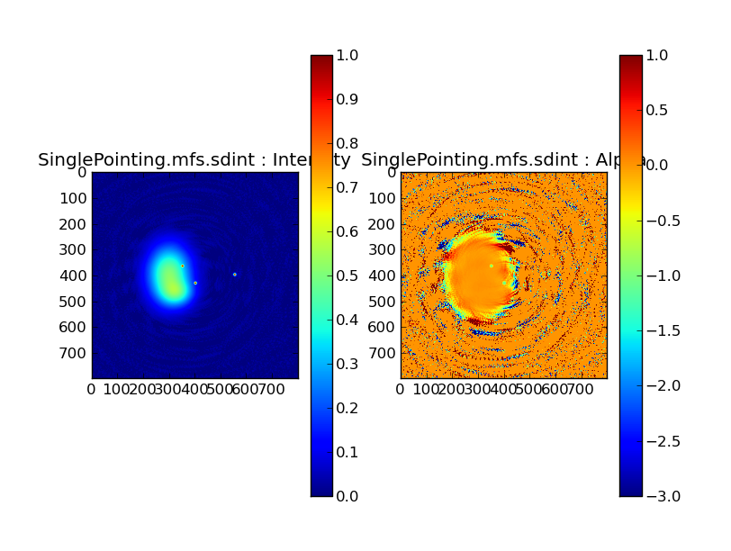
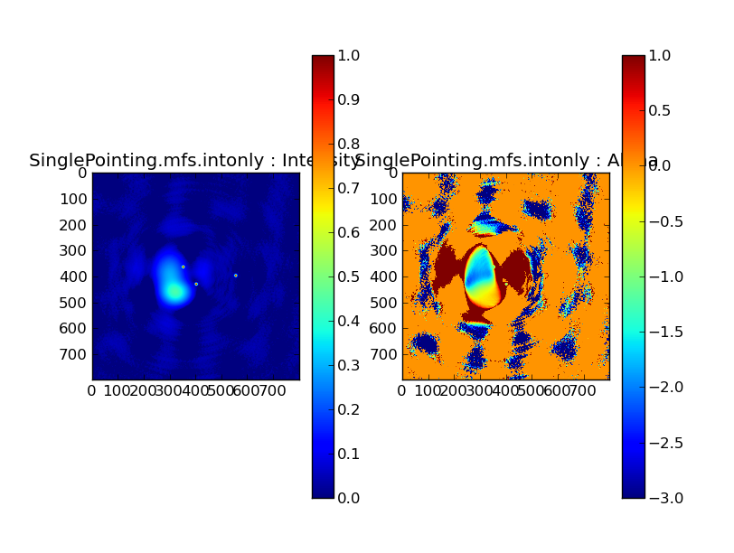
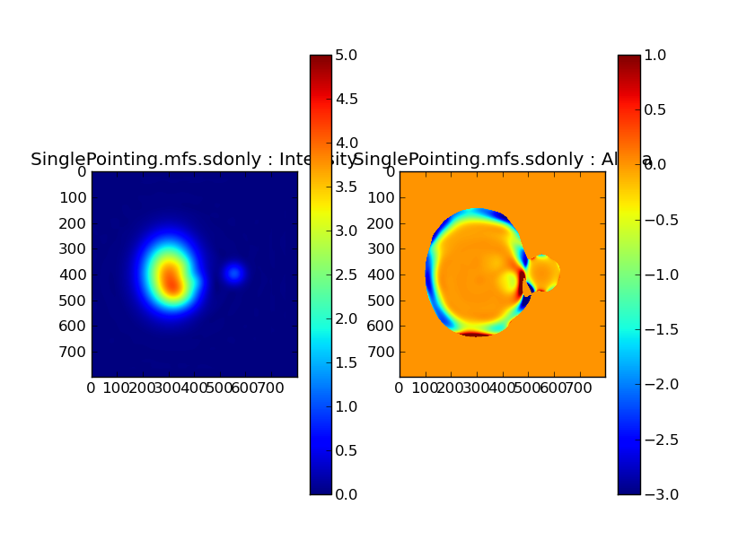
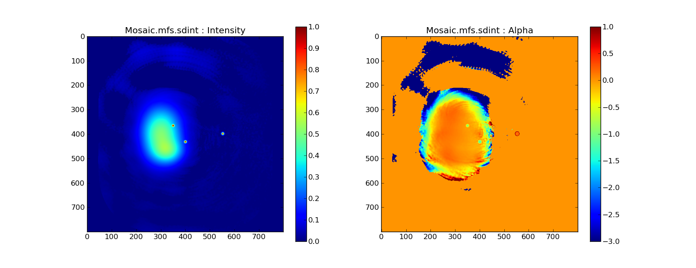
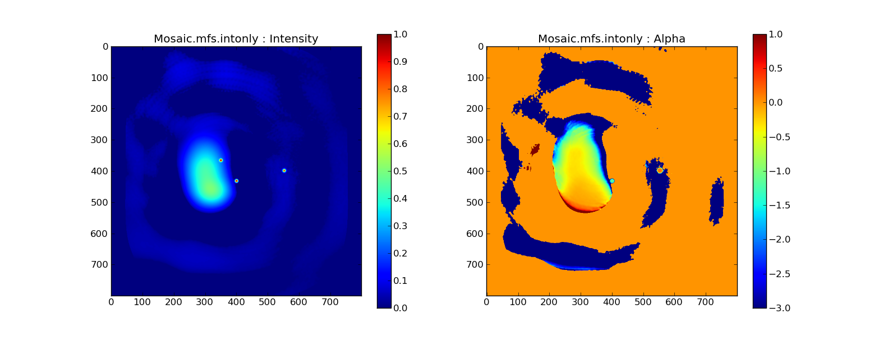
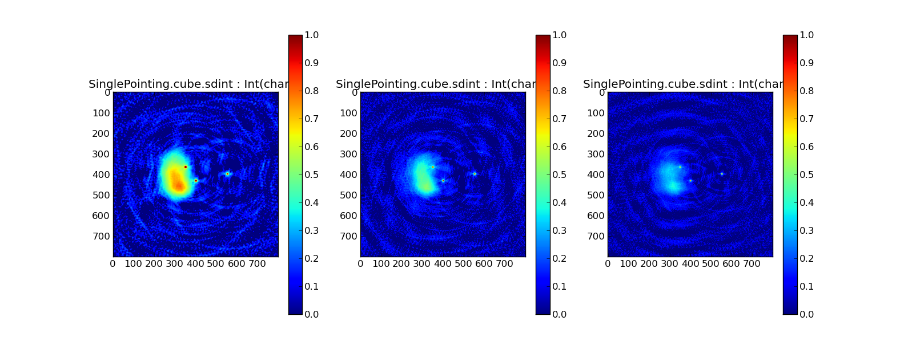
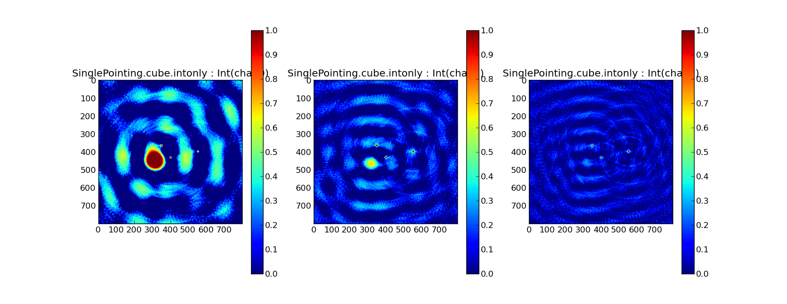
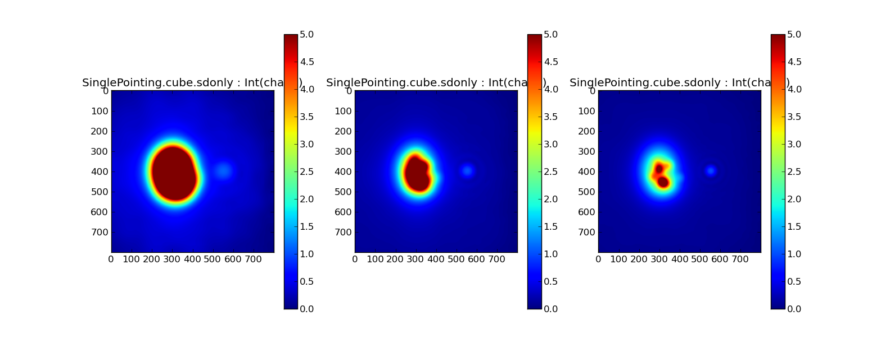

# WidebandSDINT
Joint Reconstruction of Wideband Single Dish and Interferometer data for Radio Astronomy

### Publication
[A Joint Deconvolution Algorithm to Combine Single-dish and Interferometer Data for Wideband Multiterm and Mosaic Imaging](https://iopscience.iop.org/article/10.3847/1538-3881/ab1aa7/meta) , Rau, U. ; Naik, N. ; Braun, T. Astronomical Journal, Volume 158, Number 1, June 2019 

This repository contains python scripts that work with [CASA](https://casa.nrao.edu), a pointer to two simulated datasets, and a series of output PNG figures to compare and evaluate the results of different algorithmic options. 

### Running the tests

(1) Download simulated [DATA](http://www.aoc.nrao.edu/~rurvashi/DataFiles/Data_For_WidebandSDINT_UR_github.tgz) and untar inside the Data directory.

(2) Run scripts from the Runs directory, within CASA.  

execfile('../Scripts/runsdint.py');runtest(1);runtest(2);runtest(3); etc.... 

Generated outputs are CASA log files, output CASA image files, and PNG figure files that summarize the imaging results for each example. Scripts/runsdint.py contains documentation on each of the tests triggered by runtest(num). 

Note : To only re-make the PNG figures one by one, set " action='plot' " in the call to onetest()

### Examples

The simulated source consists of large scale structures at and just below the spatial frequency range sampled by the interferometer as well as three point sources. The spectral indices of the extended component and the right-most point source is 0.0 and the other two point sources have spectral indices of -1.0.  

##### Single Pointing : A wideband imaging simulation devoid of primary beams

 Joint Reconstruction with Single Dish + Interferometer Data
 
 
 Interferometer Data only 
 
 
 Single Dish Data only
 

##### Mosaic : A wideband imaging simulation with frequency-dependent primary beams and wideband mosaic primary beam correction

 Joint Reconstruction with Single Dish + Interferometer Data
 
 
 Interferometer Data only 
 
 
 
 ##### A Cube Imaging Example  
 
Joint Reconstruction with Single Dish + Interferometer Data
 
 
 Interferometer Data only 
 
 
 Single Dish Data only
 
 
